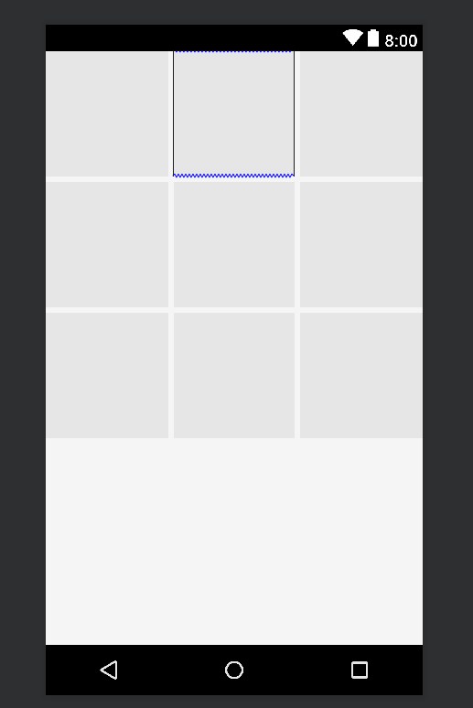

##### 简介
1. Android studio2.2新增功能
2. 有效的解决布局嵌套过多的问题

##### 使用
```
compile 'com.android.support.constraint:constraint-layout:1.0.2'
```

##### 0的含义
在ConstraintLayout中0代表：MATCH_CONSTRAINT
在ConstraintLayout中已经不支持MATCH_PARENT，通过MATCH_CONSTRAINT配合约束布局实现类似的效果

##### 属性介绍
```
//控件的左侧与父布局左侧对奇
app:layout_constraintLeft_toLeftOf="parent"

//控件的宽高比例 ratio
app:layout_constraintDimensionRatio="H,16:6"

//设置控件的权重
app:layout_constraintHorizontal_weight="1"

## chanin
//chaninStyle
app:layout_constraintHorizontal_chainStyle="spread"
--spread
所有的控件宽度设置为match_constraint, 默认就是spread
--packed
--spread_inside

//bias 设置两侧的比例(0-1.0)
app:layout_constraintVertical_bias="0.7"
```

##### Guideline
主要用于辅助布局，即类似为辅助线，横向、纵向
android:orientation="vertical"
```
//辅助线的位置
//距离控件顶部300dp的地方有个辅助线
app:layout_constraintGuide_begin="300dp"

app:layout_constraintGuide_end

// 距离顶部80%
app:layout_constraint_percent="0.8"
```

##### Barrier
跟Guideline一样属于Virtual Helper objects
与Guideline的区别于它是由多个view的大小决定的
```
//添加引用
app:constraint_referrenced_ids="tv1,tv2"

//添加方向
app:barrierDirection="end"

```

##### 性能
ConstraintLayout 在测量/布局阶段的性能比 RelativeLayout大约高 40%

##### Demo
实现9宫格效果:
```
<?xml version="1.0" encoding="utf-8"?>
<android.support.constraint.ConstraintLayout xmlns:android="http://schemas.android.com/apk/res/android"
  xmlns:app="http://schemas.android.com/apk/res-auto"
  xmlns:tools="http://schemas.android.com/tools"
  android:layout_width="match_parent"
  android:layout_height="wrap_content"
  android:paddingLeft="-2.5dp"
  android:paddingRight="-2.5dp"
  >

  <!-- 1 -->
  <ImageView
    android:id="@+id/id_nine_item_0"
    android:layout_width="0dp"
    android:layout_height="120dp"
    app:layout_constraintHorizontal_weight="1"
    app:layout_constraintLeft_toLeftOf="parent"
    app:layout_constraintRight_toLeftOf="@+id/id_nine_item_1"
    android:background="@drawable/bg_default_img"
    android:layout_marginLeft="2.5dp"
    android:layout_marginRight="2.5dp"
    />

  <ImageView
    android:id="@+id/id_nine_item_1"
    android:layout_width="0dp"
    android:layout_height="120dp"
    android:background="@drawable/bg_default_img"
    android:layout_marginLeft="2.5dp"
    android:layout_marginRight="2.5dp"
    app:layout_constraintLeft_toRightOf="@+id/id_nine_item_0"
    app:layout_constraintRight_toLeftOf="@+id/id_nine_item_2"
    app:layout_constraintHorizontal_weight="1"
   />

  <ImageView
    android:id="@+id/id_nine_item_2"
    android:layout_width="0dp"
    android:layout_height="120dp"
    android:background="@drawable/bg_default_img"
    app:layout_constraintHorizontal_weight="1"
    app:layout_constraintLeft_toRightOf="@+id/id_nine_item_1"
    app:layout_constraintRight_toRightOf="parent"
    android:layout_marginLeft="2.5dp"
    android:layout_marginRight="2.5dp"
    />

  <ImageView
    android:id="@+id/id_nine_item_3"
    android:layout_width="0dp"
    android:layout_height="120dp"
    app:layout_constraintHorizontal_weight="1"
    app:layout_constraintLeft_toLeftOf="parent"
    app:layout_constraintRight_toLeftOf="@+id/id_nine_item_4"
    android:background="@drawable/bg_default_img"
    android:layout_marginTop="5dp"
    android:layout_marginLeft="2.5dp"
    android:layout_marginRight="2.5dp"
    app:layout_constraintTop_toBottomOf="@+id/id_nine_item_0"
    />

  <ImageView
    android:id="@+id/id_nine_item_4"
    android:layout_width="0dp"
    android:layout_height="120dp"
    android:background="@drawable/bg_default_img"
    android:layout_marginLeft="2.5dp"
    android:layout_marginRight="2.5dp"
    app:layout_constraintLeft_toRightOf="@+id/id_nine_item_3"
    app:layout_constraintRight_toLeftOf="@+id/id_nine_item_5"
    app:layout_constraintHorizontal_weight="1"
    app:layout_constraintTop_toTopOf="@id/id_nine_item_3"
    />

  <ImageView
    android:id="@+id/id_nine_item_5"
    android:layout_width="0dp"
    android:layout_height="120dp"
    android:layout_marginLeft="2.5dp"
    android:layout_marginRight="2.5dp"
    android:background="@drawable/bg_default_img"
    app:layout_constraintTop_toTopOf="@id/id_nine_item_3"
    app:layout_constraintHorizontal_weight="1"
    app:layout_constraintLeft_toRightOf="@+id/id_nine_item_4"
    app:layout_constraintRight_toRightOf="parent"
    />


  <ImageView
    android:id="@+id/id_nine_item_6"
    android:layout_width="0dp"
    android:layout_height="120dp"
    app:layout_constraintHorizontal_weight="1"
    app:layout_constraintLeft_toLeftOf="parent"
    app:layout_constraintRight_toLeftOf="@+id/id_nine_item_7"
    android:background="@drawable/bg_default_img"
    android:layout_marginTop="5dp"
    android:layout_marginLeft="2.5dp"
    android:layout_marginRight="2.5dp"
    app:layout_constraintTop_toBottomOf="@+id/id_nine_item_3"
    />

  <ImageView
    android:id="@+id/id_nine_item_8"
    android:layout_width="0dp"
    android:layout_height="120dp"
    android:background="@drawable/bg_default_img"
    app:layout_constraintTop_toTopOf="@id/id_nine_item_6"
    app:layout_constraintHorizontal_weight="1"
    app:layout_constraintLeft_toRightOf="@+id/id_nine_item_7"
    app:layout_constraintRight_toRightOf="parent"
    android:layout_marginLeft="2.5dp"
    android:layout_marginRight="2.5dp"
    />


  <ImageView
    android:id="@+id/id_nine_item_7"
    android:layout_width="0dp"
    android:layout_height="120dp"
    android:layout_marginLeft="2.5dp"
    android:layout_marginRight="2.5dp"
    android:background="@drawable/bg_default_img"
    app:layout_constraintHorizontal_weight="1"
    app:layout_constraintLeft_toRightOf="@+id/id_nine_item_6"
    app:layout_constraintRight_toLeftOf="@+id/id_nine_item_8"
    app:layout_constraintTop_toTopOf="@id/id_nine_item_6"
    />


</android.support.constraint.ConstraintLayout>
```
效果图如下:



##### 参考
[1] https://blog.csdn.net/guolin_blog/article/details/53122387
[2] https://blog.csdn.net/lmj623565791/article/details/78011599
[3] https://mp.weixin.qq.com/s/gGR2itbY7hh9fo61SxaMQQ
[4] http://www.jcodecraeer.com/a/anzhuokaifa/androidkaifa/2017/1017/8601.html
[5] https://developer.android.com/training/constraint-layout/
[6] http://www.uwanttolearn.com/android/constraint-layout-animations-dynamic-constraints-ui-java-hell/
