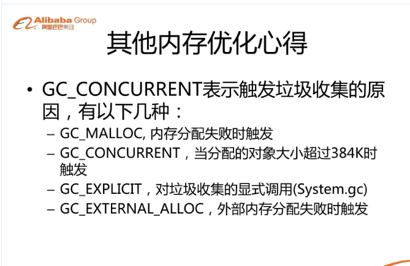

参数inpreferredconfig的可选值有四个，分别为ALPHA_8，RGB_565，ARGB_4444，ARGB_8888。
https://blog.csdn.net/ccpat/article/details/46834089

我们使用BitmapFactory.decodeResource()方法来从资源文件中读取一张图片并生成一个Bitmap。但如果使用一个BitmapFactory.Options对象，并把该对象的inJustDecodeBounds属性设置为true，decodeResource()方法就不会生成Bitmap对象，而仅仅是读取该图片的尺寸和类型信息

Dalvik 有两种基本的 GC 模式， GC_CONCURRENT 和 GC_FOR_ALLOC ，这两种你都可以在 logcat 中看到。

GC_CONCURRENT 对于每次收集将阻塞主线程大约 5ms 。因为每个操作都比一帧(16ms)要小，GC_CONCURRENT 通常不会造成你的应用丢帧。
GC_FOR_ALLOC 是一种 stop-the-world 收集，可能会阻塞主线程达到 125ms 以上。GC_FOR_ALLOC 几乎每次都会造成你的应用丢失多个帧，导致视觉卡顿，特别是在滑动的时候。
