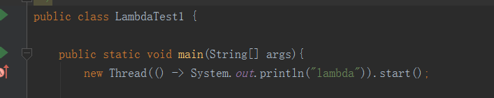
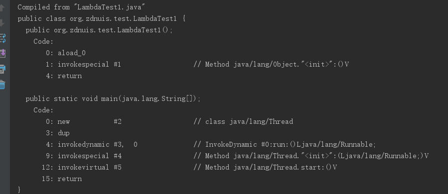
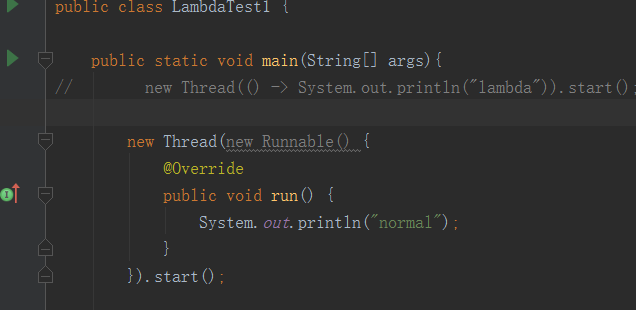
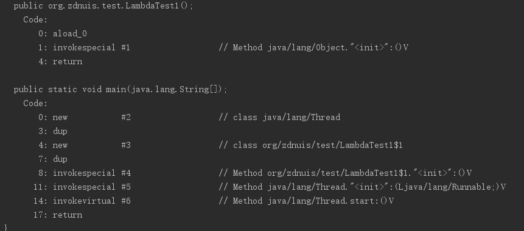

##### 作用
lambda表达式取代了匿名内部类，允许用函数式风格编写代码，使代码可读性更高

##### 格式
基本格式是：() -> {}
有下面三中具体表达：
1. (params) -> expression
2. (params) -> statement
3. (params) -> {statement}

##### 与匿名内部类的比较
1. 关键字this  匿名内部类的this关键字指向匿名类，而lambda表达式的this关键字指向包围lambda表达式的类
2. 编译方式  Java编译器将lambda表达式编译成类的私有方法 使用了Java 7 的invokedynamic 字节码指令来动态绑定这个方法

###### 示例








##### 方法引用
```
//定义一个用来测试字符串是否为空的接口
interface PreListener{
  boolean test(String str);
}

public void setPreListener(PreListener listener){
  ...
}

//使用
sertPreListener(s -> TextUtils.isEmpty(s));

//简化
setPreListener(TextUtils::isEmpty);

```
方法引用形式就是当逻辑实现只有一句话且调用了已存在的方法进行处理（this和super的方法也可包含在内）时，对函数式接口形式的lambda表达式进行进一步的简化。传入引用的方法的参数就是原接口方法的参数

##### 变量捕获
Java 8 中，新增了一个 effective final 功能，只要一个变量没有被修改过引用（基本变量则不能更改变量值），即为实质上的 final 变量，那么不用再在声明变量时加上 final 修饰符


##### 方法数差异
当前 Android Studio 对 Java 8 新特性编译时采用脱糖（desugar）处理，lambda 表达式经过编译器编译后，每一个 lambda 表达式都会增加 1~2 个方法数。而 Android 应用的方法数不能超过 65536 个


##### 参考
[1] http://www.jianshu.com/p/5fc2b3362702   
[2] https://bryantpang.github.io/2017/04/30/LambdaExpression/#more  
[3] http://colobu.com/2014/11/06/secrets-of-java-8-lambda/
